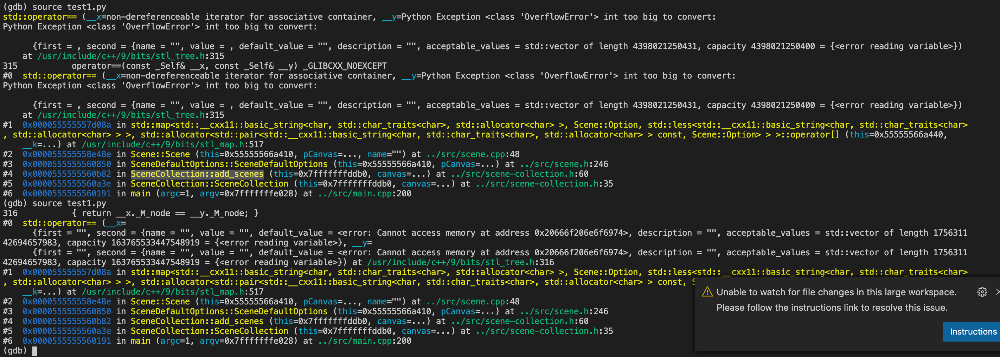

# callTraceWithGdb
通过分析GDB back trace 找出目标程序全部函数调用过程

## 使用方法

启动GDB（以调试glmark2为例）
```bash
gdb glmark2
```

设置参数，运行trace.py脚本
- output_file_name
- first_bp
- loop_numebr
```bash
(gdb) source trace.py
```

## 代码笔记

### 逻辑前提

GDB每次step，函数调用栈最多只能进栈一次，但可以出栈多次，且进栈出栈可以同时进行

### 基本思路
keep前后两次step后的函数调用栈
- 若当前栈高于前一次：说明进栈，在结果中按相应缩进打印新的函数调用
- 若高度相等
    - 栈顶一致：没有变化，进行下次step
    - 栈顶不一致：先出栈一次后进栈新的call，前移缩进后打印结果
- 若当前栈低于前一次：说明至少出栈多次，是否新进栈未知
    - 首先根据高度差前移缩进
    - 判断新栈顶与旧栈相应位置是否相同，不相同则说明有新进栈，调整缩进打印结果

### 遇到的问题
- 使用GDB的python api添加断点，如果不是当前程序内部函数断点需要输入y确认pending on：直接在脚本中gdb.execute('set breakpoint pending on')默认选择y

- back trace结果的开头如果非栈顶会有内存地址等信息，与栈顶不统一，后续比较会出现问题：删除in之前的内容（注意有的结果中有in seconds关键字，要避免误删除）

- 有的函数在第一次进栈时this指针还是空指针，step一次之后this指针就变了，但还是同一个函数调用不能算为两个：所以在预处理中把this指针的信息删掉

- 观察发现竟然bt里面某些项竟然有断行（下图），导致用换行符split的时候将一项分成了多项：每次拿到bt结果后先遍历每一行是否是'#'开头再split，不是的就删掉\
还要注意循环删除要倒序遍历，否则可能会index out of range



### todo
- 所有mesa函数加断点，直接continue到下个函数，但问题是中间可能会丢失很多已经出栈的信息，导致最后结果没有连贯性
- 什么时候结束的问题，现在是设定step的次数

